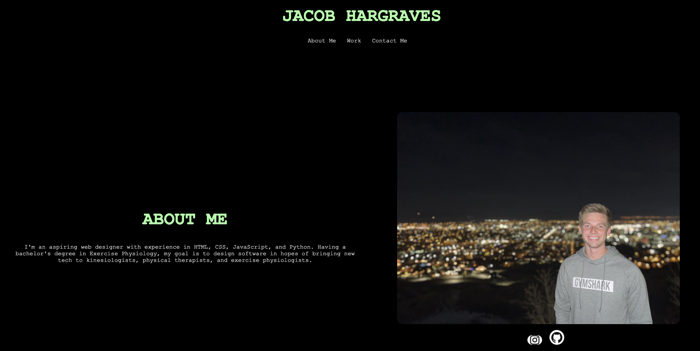

# Bootcamp Portfolio Website

## Description
This project allows future employers to view my website.
It is a portfolio website containing an about me section with links to social media and GitHub, a work showcase that consists of my recent web applications, and a contact section. 
Each project link will deploy the web application that it is referring to.  The website is mobile responsive. It also contains a form to submit an email in order to contact me.

## Installation

N/A

## Usage
In order to view this website, please visit 
https://jacobhargraves.github.io/bootcamp-portfolio/

View in GitHub:
https://github.com/jacobhargraves/bootcamp-portfolio

## Credits

Tutorials followed:
Grids: https://www.youtube.com/watch?v=rg7Fvvl3taU
Mobile Responsive: https://www.youtube.com/watch?v=VQraviuwbzU

## License

N/A